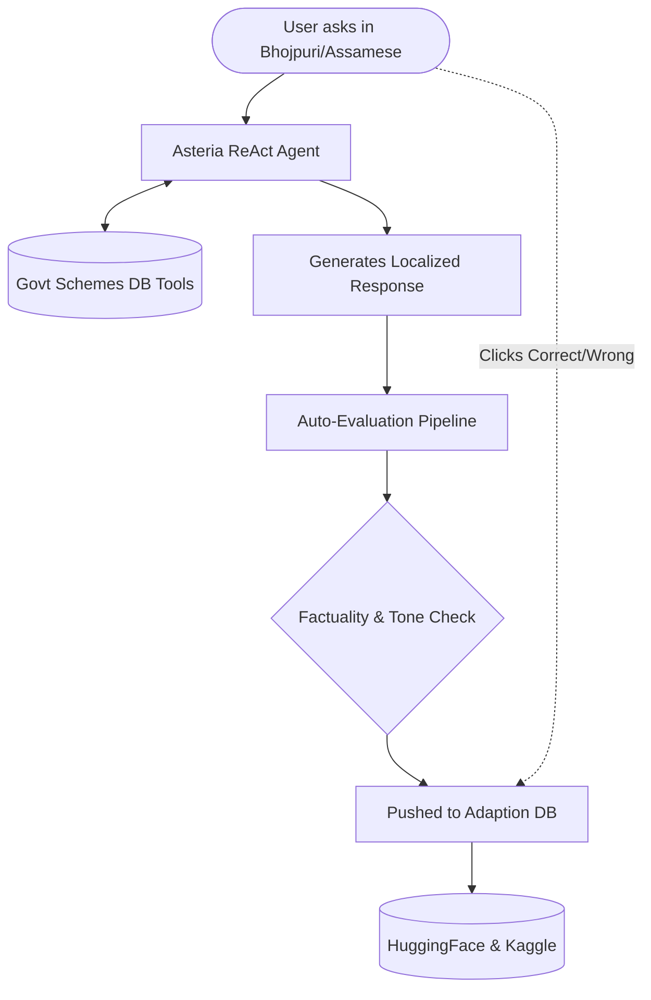

<div align="center">
  
  
  
  
  
  <br/><br/>

  <h1 align="center">🌟 Asteria</h1>
  <p align="center">
    <strong>An Autonomous AI Agent for Low-Resource Indian Languages</strong>
    <br/>
    <em>Bhojpuri & Assamese Civic Support System powered by Adaptive Data</em>
  </p>

  <p align="center">
    <a href="https://huggingface.co/datasets/Afuu-coder/asteria-bhojpuri-assamese-civic-qa"></a>
    <a href="https://asteria-civic-agent-938171168741.us-central1.run.app"></a>
    <a href="https://adaption.ai"></a>
  </p>
  
  <p align="center"><b>Built for the AI Agents Hackathon 2026 · HackIndia</b></p>
</div>

<br/>

## 🎯 The Vision

India has hundreds of millions of citizens who communicate exclusively in regional languages. While AI has advanced rapidly, **Low-Resource Languages like Bhojpuri (50M+ speakers) and Assamese (15M+ speakers)** are often left behind. 

**Asteria** bridges this digital divide. It is a fully autonomous **ReAct-based AI Agent** that helps rural citizens access critical government welfare schemes in their native language. Powered by **Adaption's Adaptive Data ecosystem**, Asteria learns from every interaction, automatically evaluating its responses and exporting high-quality synthetic data back to the open-source community.

---

## 🏆 Key Innovations

| Feature | Description |
| :--- | :--- |
| 🤖 **True Autonomous Agent** | Built on the **ReAct (Reason + Act)** framework. It doesn't just chat; it thinks, uses tools to lookup eligibility, and formulates step-by-step application plans. |
| 🗣️ **Dual Low-Resource Focus** | Native support for **Bhojpuri** and **Assamese**, trained using high-quality prompt-engineered pipelines via Gemini 1.5 Flash. |
| 📊 **Adaptive Data Loop** | Features a full data pipeline: Ingest → Adapt → Auto-Evaluate → Export. It scores its own factuality and learns from user feedback. |
| ✨ **Premium Glassmorphism UI** | A stunning, lightweight, pure HTML/CSS/JS frontend featuring animated UI components, custom tooltips, and real-time reasoning traces. |
| 🚀 **Google Cloud Run** | Containerized with Docker and deployed to Google Cloud Run for professional scalability. |

---

## 🌐 Government Schemes Covered

Asteria comes pre-equipped with an extensive knowledge base of core Indian civic schemes:

- 🌾 **PM Kisan Samman Nidhi** — ₹6000/year financial support for farmers.
- 🏥 **Ayushman Bharat (PM-JAY)** — Up to ₹5 lakh health insurance coverage.
- 🏠 **PM Awas Yojana (PMAY-G)** — Housing assistance for the rural poor.
- 🔥 **PM Ujjwala Yojana** — Free LPG gas connections for women below the poverty line.
- 🏦 **PM Jan Dhan Yojana (PMJDY)** — Zero-balance bank accounts for financial inclusion.
- 🌱 **PM Fasal Bima Yojana (PMFBY)** — Crop insurance against natural calamities.
- 🍚 **Ration Card (NFSA)** — Subsidized food grains through the PDS system.

---

## ⚙️ Architecture & Pipeline

Asteria isn't just a wrapper; it's a living ecosystem of data.



---

## 🔁 Powered by Adaption AI

Asteria heavily integrates **[Adaption](https://adaption.ai)** to ensure continuous improvement and factuality. Rather than just relying on standard LLM responses, we use the Adaption Python SDK to build a robust feedback loop:

- **Session Tracking:** Every user chat session is traced and logged into the Adaption platform for deep analytics.
- **Auto-Evaluation:** Asteria uses a background evaluator agent that automatically grades the ReAct agent's responses based on `Factuality` and `Tone` using Adaption's evaluation suite.
- **User Feedback Loop:** The frontend features Thumbs Up/Down buttons that send immediate RLHF (Reinforcement Learning from Human Feedback) signals back to the Adaption dataset.
- **Synthetic Data Generation:** High-quality interactions are tagged and exported to Hugging Face to build the ultimate open-source Civic QA dataset for Low-Resource Languages.

---

## 💻 Tech Stack

- **Backend:** Python, FastAPI, Uvicorn
- **AI/LLM:** Google Gemini 1.5 Flash (Vertex AI API)
- **Agent Framework:** Custom ReAct Engine
- **Data Platform:** Adaption Python SDK
- **Frontend:** Vanilla JavaScript, Glassmorphism CSS, HTML5
- **Deployment:** Docker, Google Cloud Run

---

## 🚀 Quick Start (Run Locally)

Want to run the agent on your own machine? Follow these steps:

### 1. Clone & Setup
```bash
git clone https://github.com/yourusername/asteria-agent.git
cd asteria-agent
python -m venv venv
venv\Scripts\activate       # Windows
# source venv/bin/activate  # Mac/Linux
pip install -r backend\requirements.txt
```

### 2. Configure API Keys
```bash
copy .env.example .env
# Edit the .env file and add your GEMINI_API_KEY and ADAPTION_API_KEY
```

### 3. Start the Server
```bash
cd backend
python main.py
```

### 4. Chat with Asteria
Open your browser and navigate to:
👉 **[http://localhost:8000](http://localhost:8000)**

---

## ☁️ Deploy to Google Cloud Run

This project is fully Dockerized and optimized for Google Cloud Run.

1. Ensure you have the `gcloud` CLI installed and authenticated.
2. Enable necessary APIs and assign proper IAM roles to your service account (e.g., `aiplatform.user`).
3. Deploy directly using the source code:
```bash
gcloud run deploy asteria-civic-agent \
  --source . \
  --project YOUR_PROJECT_ID \
  --region us-central1 \
  --platform managed \
  --allow-unauthenticated \
  --port 8080 \
  --set-env-vars "GEMINI_API_KEY=your_key,ADAPTION_API_KEY=your_key,ADAPTION_BASE_URL=https://api.adaption.ai"
```

---

## 📚 Open Source Dataset

As part of this project, we have successfully generated, evaluated, and open-sourced a high-quality QA dataset for these low-resource languages.

🔗 **[View Dataset on HuggingFace Hub](https://huggingface.co/datasets/Afuu-coder/asteria-bhojpuri-assamese-civic-qa)**

---

<div align="center">
  <p>Built with ❤️ for rural India during the <b>AI Agents Hackathon 2026</b></p>
</div>
